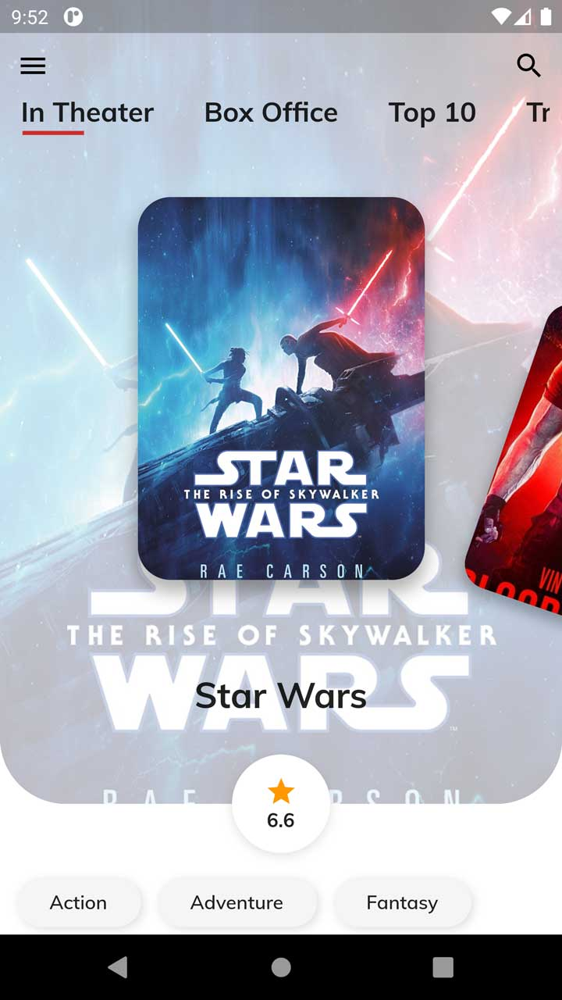
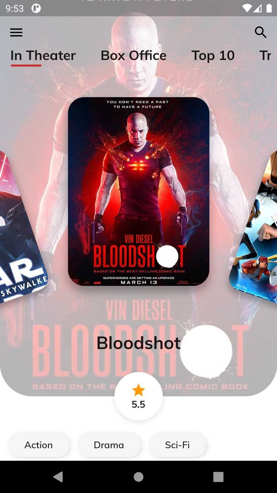
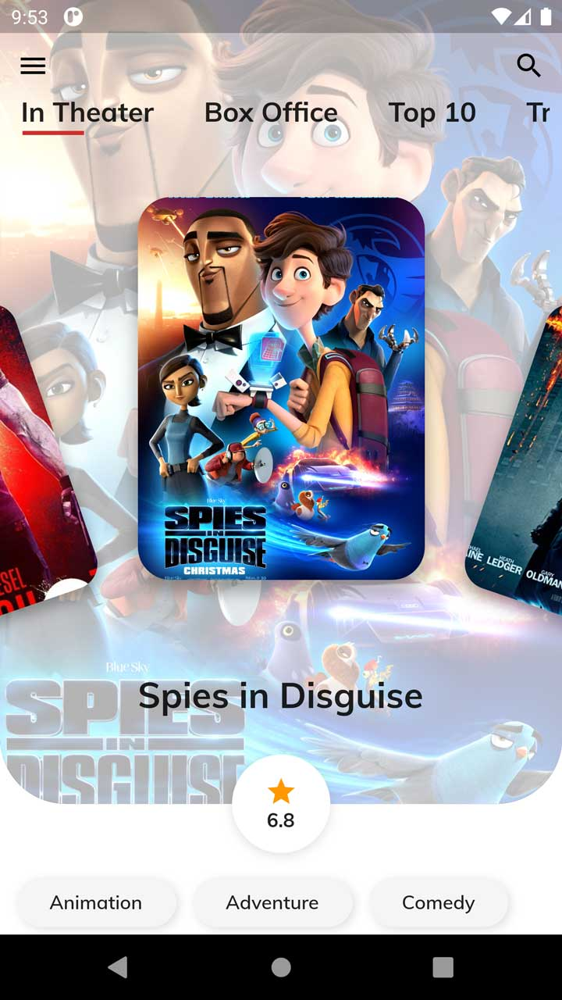

# Flutter Movie Concept UI

## Android Demo

  

## Android Screenshots

  
  
  

## Requirements to run locally

> Just in case if you ran into errors make sure you're using correct flutter & dart version. In order to support desktop build master branch is a requirement But Master branch is not stable so breaking changes happen on daily updates.

- Flutter master channel & Framework • revision `e3c6979d1b`
  - Run `flutter --version` to check it
- Dart VM version: 2.7.1
  - Run `dart --version` to check it
- Follow these step to use correct revision version
  - Run `cd $FLUTTER_HOME` (where your flutter is installed)
  - Run `git checkout master`
  - Run `git checkout e3c6979d1b`
- To enable desktop & web builds run the relevant command
  - Run `flutter --enable-web`
  - Run `flutter --enable-macos-desktop`
  - Run `flutter --enable-linux-desktop`
  - Run `flutter --enable-windows-desktop`
- Run `flutter doctor` this command will show you what dependencies you need to install.

## Scripts

- `mac.pub.dart`
  - MacOS app doesn't compile if you include firebase libraries in pubspec.
  - When you run `dart scripts/mac.pub.dart` this script it remove firebase dependencies from project's `pubspec`.
  - You can compile your app peacefully.
  - Make sure to run `dart scripts/mac.pub.dart restore` when you're done testing/compile for MacOS app.
  - With `restore` flag your `pubspec` will revert to it's original form.
- `vslaunch.dart`
  - execute `dart scripts/vslaunch.dart`
  - This script will make vscode configuration file with all of your connected devices.
  - You can live debug app on multiple devices at once from vs code.
  - Each device's debug logs on separate **DEBUG CONSOLE**.
  - Very useful for testing UI for multiple devices simultaneously.

## Show support

> **If you like the project and want to appreciate my effort. Then you may perform any of these steps :)**

- Star this repository.
- Rate the app on <a href="https://play.google.com/store/apps/details?id=com.onemdev.invmovieconcept1" target="playstore">Play Store</a>.
- Endorse my skills on my <a href="https://www.linkedin.com/in/hackerhgl" target="linkedin">Linkedin Profile</a>.
- Favorite my gigs on <a href="https://www.fiverr.com/hackerhgl" target="fiver">Fiverr</a>.
- Give a recommendation on <a href="https://www.freelancer.com/u/hackerhgl" target="freelance">Freelancer</a>.

## Download

  
  
  
  
  

## License

This project is licensed under the MIT license, Copyright (c) 2020 Hamza Iqbal. For more information see `LICENSE.md`.
